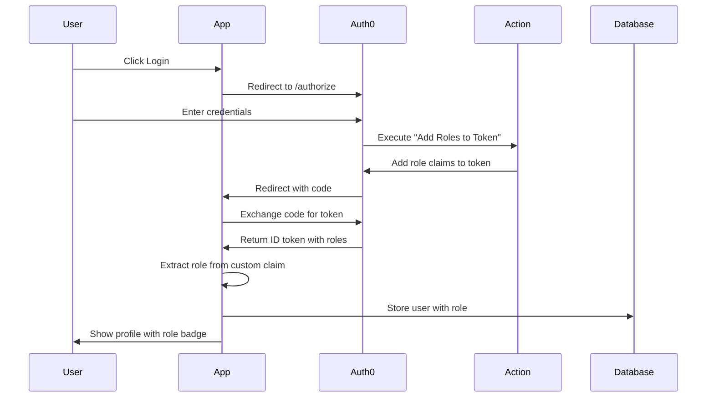

# Auth0 Action Setup Guide - REQUIRED

**⚠️ IMPORTANT**: You MUST create this Auth0 Action for roles to work!

## Why This Is Required

The standard OAuth flow does NOT include user roles in tokens. You need to add an **Auth0 Action** that adds roles as custom claims to the ID token during login.

## Step-by-Step Setup

### Step 1: Create Roles in Auth0

1. Go to **Auth0 Dashboard** → **User Management** → **Roles**
2. Click **Create Role**
3. Create these three roles:

   | Name | Description |
   |------|-------------|
   | `user` | Standard user access (default) |
   | `organizer` | Can manage leagues and matches |
   | `admin` | Full system access |

### Step 2: Assign Roles to Users

1. Go to **User Management** → **Users**
2. Click on a user
3. Go to **Roles** tab
4. Click **Assign Role**
5. Select a role and click **Assign**

**Test with yourself first!** Assign the `admin` role to your own account.

### Step 3: Create the Auth0 Action

1. Go to **Auth0 Dashboard** → **Actions** → **Library**
2. Click **Build Custom**
3. Use these settings:
   - **Name**: `Add Roles to Token`
   - **Trigger**: `Login / Post Login`
   - **Runtime**: `Node 18` (or latest)

4. **Replace ALL the code** with this:

```javascript
/**
 * Handler that will be called during the execution of a PostLogin flow.
 *
 * @param {Event} event - Details about the user and the context in which they are logging in.
 * @param {PostLoginAPI} api - Interface whose methods can be used to change the behavior of the login.
 */
exports.onExecutePostLogin = async (event, api) => {
  const namespace = 'https://40k-escalation.app';
  
  // Get user roles from authorization context
  const roles = event.authorization?.roles || [];
  
  // Determine primary role (admin > organizer > user)
  let primaryRole = 'user';
  if (roles.includes('admin')) {
    primaryRole = 'admin';
  } else if (roles.includes('organizer')) {
    primaryRole = 'organizer';
  }
  
  // Add custom claims to ID token (these will appear in /userinfo)
  api.idToken.setCustomClaim(`${namespace}/role`, primaryRole);
  api.idToken.setCustomClaim(`${namespace}/roles`, roles);
  
  // Also add to access token for API access
  api.accessToken.setCustomClaim(`${namespace}/role`, primaryRole);
  api.accessToken.setCustomClaim(`${namespace}/roles`, roles);
};
```

5. Click **Deploy** (top right corner)

### Step 4: Add Action to Login Trigger

**Note:** Newer Auth0 Dashboards show "Triggers" instead of "Flows"

1. Go to **Actions** → **Triggers** (or **Actions** → **Flows** → **Login** on older dashboards)
2. Find and click on **Login** trigger
3. You'll see a flow/trigger diagram with:
   - **Start** (left)
   - **Complete** (right)
   - **Custom** tab on the right sidebar
4. Find your **Add Roles to Token** action in the Custom tab (right side)
5. **Drag and drop** it between Start and Complete in the diagram
6. Click **Apply** (top right corner)

The trigger should look like:
```
Start → Add Roles to Token → Complete
```

### Step 5: Test the Implementation

1. **Clear your browser cookies** (important!)
2. Go to your app and click **Login**
3. Login with your Auth0 account
4. Check the server console - you should see:
   ```
   User role from Auth0: admin All roles: ['admin']
   ```
5. Go to `/profile` page
6. You should see your role badge (Red for admin, Purple for organizer, Blue for user)

## Troubleshooting

### Issue: Still seeing "user" role when I should be admin

**Solution**: Make sure you:
1. Created the Action correctly (copy the code exactly)
2. **Deployed** the Action (click Deploy button)
3. Added it to the Login Flow (drag & drop)
4. Clicked **Apply** on the flow
5. Cleared browser cookies and logged in again
6. Assigned the role to your user in Auth0 Dashboard

### Issue: Console shows "undefined" for role

**Solution**: 
1. Check the Action is in the Login Trigger (or Flow)
2. Verify the Action is deployed (should have green checkmark)
3. Try logging out and logging in again
4. Check Auth0 logs: **Monitoring** → **Logs** (look for errors)

### Issue: Action not showing up in Custom tab

**Solution**:
1. Make sure you selected **Login / Post Login** as the trigger when creating
2. The Action must be deployed (not just saved)
3. Refresh the Actions → Triggers (or Flows) page

## How It Works



## Custom Claim Namespace

We use the namespace: `https://40k-escalation.app`

This prevents naming conflicts with other claims. Auth0 requires namespaced custom claims for security.

The role will be stored as:
- `https://40k-escalation.app/role` → `"admin"`
- `https://40k-escalation.app/roles` → `["admin"]`

## Role Hierarchy

```
admin (highest privilege)
  ↓
organizer
  ↓
user (default)
```

## Verifying It Works

### Check 1: Auth0 Logs
1. Go to **Monitoring** → **Logs**
2. Look for "Success Login" events
3. Click on one → **Context Data** → **ID Token**
4. Should see: `"https://40k-escalation.app/role": "admin"`

### Check 2: Server Console
After login, check your terminal for:
```
User role from Auth0: admin All roles: ['admin']
```

### Check 3: Profile Page
Visit `/profile` and verify:
- Role badge displays
- Correct color (Red/Purple/Blue)
- Shows correct role name

### Check 4: Database
Query your database:
```sql
SELECT id, email, name, role FROM users;
```
Should show the correct role.

## Security Notes

1. **Never modify roles on the client side** - They're set during login and verified on server
2. **Roles are in the token** - No additional API calls needed
3. **Namespace prevents conflicts** - Other apps won't collide with our claims
4. **Roles sync on every login** - If you change a role in Auth0, user gets new role on next login

## Alternative: Manual Testing Without Action

If you want to test the UI without setting up Auth0 Action:

1. The role will default to `'user'`
2. You can manually update the database:
   ```sql
   UPDATE users SET role = 'admin' WHERE email = 'your@email.com';
   ```
3. But roles won't sync from Auth0 until you set up the Action

## Need Help?

Common Auth0 Action documentation:
- [Actions Overview](https://auth0.com/docs/customize/actions)
- [Post-Login Actions](https://auth0.com/docs/customize/actions/flows-and-triggers/login-flow)
- [Custom Claims](https://auth0.com/docs/secure/tokens/json-web-tokens/create-custom-claims)

---

**Last Updated**: October 14, 2025  
**Status**: ✅ Required for role functionality
